p8105\_hw6\_sl4836
================
Hun
12/2/2021

## Problem 0 - Creating a subdirectory

``` r
dir.create(file.path(getwd(), "hw6_data_file"), recursive = TRUE)
```

    ## Warning in dir.create(file.path(getwd(), "hw6_data_file"), recursive = TRUE): '/
    ## Users/iseonghun/Desktop/columbia data science/p8105_hw6_sl4836/hw6_data_file'
    ## already exists

# Problem 1

## Importing data

``` r
birthweight_data <- read_csv("./hw6_data_file/birthweight.csv")
```

## Tidying and wrangling the data

``` r
cleaned_birthweight_data <-
  birthweight_data %>% 
  janitor::clean_names() %>%
  mutate(across(.cols = c(babysex, frace, malform, mrace), as.factor)) %>%
  mutate(babysex = ifelse(babysex == "1", "male","female"),
         malform = ifelse(malform == "0", "absent","present"),
         frace = recode(frace, "1" = "White", "2" = "Black", "3" = "Asian", 
                        "4" = "Puerto Rican", "8" = "Other", "9" = "Unknown"),
         mrace = recode(mrace, "1" = "White", "2" = "Black", 
                        "3" = "Asian", "4" = "Puerto Rican", "8" = "Other")
         )
```

In the process of tidying and wrangling the data, I turned **babysex,
frace, malform, and mrace** into factors because they are categorical
variables. Plus, for these categorical variables, I recoded their
numerical values to their associated information based on the assignment
pdf.

## Checking Missing Values and the summary of the dataset

``` r
skimr::skim(cleaned_birthweight_data)
```

|                                                  |                            |
|:-------------------------------------------------|:---------------------------|
| Name                                             | cleaned\_birthweight\_data |
| Number of rows                                   | 4342                       |
| Number of columns                                | 20                         |
| \_\_\_\_\_\_\_\_\_\_\_\_\_\_\_\_\_\_\_\_\_\_\_   |                            |
| Column type frequency:                           |                            |
| character                                        | 2                          |
| factor                                           | 2                          |
| numeric                                          | 16                         |
| \_\_\_\_\_\_\_\_\_\_\_\_\_\_\_\_\_\_\_\_\_\_\_\_ |                            |
| Group variables                                  | None                       |

Data summary

**Variable type: character**

| skim\_variable | n\_missing | complete\_rate | min | max | empty | n\_unique | whitespace |
|:---------------|-----------:|---------------:|----:|----:|------:|----------:|-----------:|
| babysex        |          0 |              1 |   4 |   6 |     0 |         2 |          0 |
| malform        |          0 |              1 |   6 |   7 |     0 |         2 |          0 |

**Variable type: factor**

| skim\_variable | n\_missing | complete\_rate | ordered | n\_unique | top\_counts                             |
|:---------------|-----------:|---------------:|:--------|----------:|:----------------------------------------|
| frace          |          0 |              1 | FALSE   |         5 | Whi: 2123, Bla: 1911, Pue: 248, Asi: 46 |
| mrace          |          0 |              1 | FALSE   |         4 | Whi: 2147, Bla: 1909, Pue: 243, Asi: 43 |

**Variable type: numeric**

| skim\_variable | n\_missing | complete\_rate |    mean |     sd |     p0 |     p25 |     p50 |     p75 |   p100 | hist  |
|:---------------|-----------:|---------------:|--------:|-------:|-------:|--------:|--------:|--------:|-------:|:------|
| bhead          |          0 |              1 |   33.65 |   1.62 |  21.00 |   33.00 |   34.00 |   35.00 |   41.0 | ▁▁▆▇▁ |
| blength        |          0 |              1 |   49.75 |   2.72 |  20.00 |   48.00 |   50.00 |   51.00 |   63.0 | ▁▁▁▇▁ |
| bwt            |          0 |              1 | 3114.40 | 512.15 | 595.00 | 2807.00 | 3132.50 | 3459.00 | 4791.0 | ▁▁▇▇▁ |
| delwt          |          0 |              1 |  145.57 |  22.21 |  86.00 |  131.00 |  143.00 |  157.00 |  334.0 | ▅▇▁▁▁ |
| fincome        |          0 |              1 |   44.11 |  25.98 |   0.00 |   25.00 |   35.00 |   65.00 |   96.0 | ▃▇▅▂▃ |
| gaweeks        |          0 |              1 |   39.43 |   3.15 |  17.70 |   38.30 |   39.90 |   41.10 |   51.3 | ▁▁▂▇▁ |
| menarche       |          0 |              1 |   12.51 |   1.48 |   0.00 |   12.00 |   12.00 |   13.00 |   19.0 | ▁▁▂▇▁ |
| mheight        |          0 |              1 |   63.49 |   2.66 |  48.00 |   62.00 |   63.00 |   65.00 |   77.0 | ▁▁▇▂▁ |
| momage         |          0 |              1 |   20.30 |   3.88 |  12.00 |   18.00 |   20.00 |   22.00 |   44.0 | ▅▇▂▁▁ |
| parity         |          0 |              1 |    0.00 |   0.10 |   0.00 |    0.00 |    0.00 |    0.00 |    6.0 | ▇▁▁▁▁ |
| pnumlbw        |          0 |              1 |    0.00 |   0.00 |   0.00 |    0.00 |    0.00 |    0.00 |    0.0 | ▁▁▇▁▁ |
| pnumsga        |          0 |              1 |    0.00 |   0.00 |   0.00 |    0.00 |    0.00 |    0.00 |    0.0 | ▁▁▇▁▁ |
| ppbmi          |          0 |              1 |   21.57 |   3.18 |  13.07 |   19.53 |   21.03 |   22.91 |   46.1 | ▃▇▁▁▁ |
| ppwt           |          0 |              1 |  123.49 |  20.16 |  70.00 |  110.00 |  120.00 |  134.00 |  287.0 | ▅▇▁▁▁ |
| smoken         |          0 |              1 |    4.15 |   7.41 |   0.00 |    0.00 |    0.00 |    5.00 |   60.0 | ▇▁▁▁▁ |
| wtgain         |          0 |              1 |   22.08 |  10.94 | -46.00 |   15.00 |   22.00 |   28.00 |   89.0 | ▁▁▇▁▁ |

``` r
birthweight_data_variables <- names(birthweight_data)
birthweight_data_nrow <- nrow(birthweight_data)
birthweight_data_ncol <- ncol(birthweight_data)
```

There is no missing data. The dimension of the birthweight data is
**4342 x** **20.** There are **4342** number of observations and **20**
variables: *babysex, bhead, blength, bwt, delwt, fincome, frace,
gaweeks, malform, menarche, mheight, momage, mrace, parity, pnumlbw,
pnumsga, ppbmi, ppwt, smoken, wtgain.*

## Computing Correlation Matrix

``` r
birthweight_data %>% 
  cor_mat() %>%
  cor_gather() %>%
  filter(var1 %in% "bwt") %>%
  filter(!var2 %in% "bwt") %>%
  mutate(
    sig_p = ifelse(p < 0.01, T, F),
    cor_if_sig = ifelse(p < 0.01, cor, NA)
    ) %>% 
  ggplot(aes(
    x = var1, 
    y = var2, 
    fill = cor,
    label = round(cor_if_sig, 2))) + 
  geom_tile(color = "white") +   
  geom_text(
    color = "white",
    size = 4
  ) + 
  scale_x_discrete(
    labels = c("Birth Weight")
  ) + 
  labs(
    x = "Outcome Variable",
    y = "Predictor Variables",
    title = "Correlation Matrix between Predictors and Outcome",
    subtitle = "significant predictors at significance level 0.01",
    fill = "Correlation"
  )
```

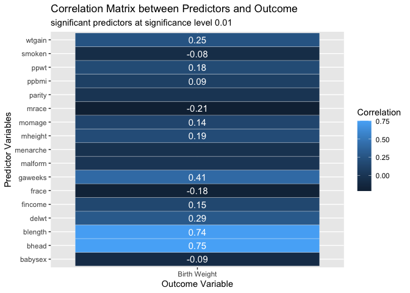<!-- -->

``` r
continuous_variables <-  
  cleaned_birthweight_data %>%
  select_if(is.numeric) %>%
  select(-bwt, -ppbmi, -ppwt, -pnumsga, -parity, -pnumlbw) %>%
  colnames() %>% 
  as.vector()
```

Computing pearson correlation matrix with p-values based on T-test for
correlation coefficient. Based on this correlation matrix, I selected
continuous variables to be used to fit a scatterplot against the outcome
variable in order to check if there is any lienar trend between
continuous predictors and the outcome variable. The selected variables
are: *bhead, blength, delwt, fincome, gaweeks, menarche, mheight,
momage, smoken, wtgain.*

## Fitting scatterplots with selected predictors against birthweight to see if there is a linear trend between continuous predictors and the outcome variable

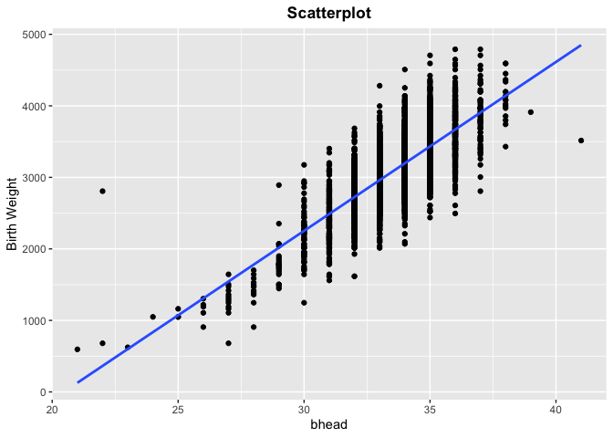<!-- -->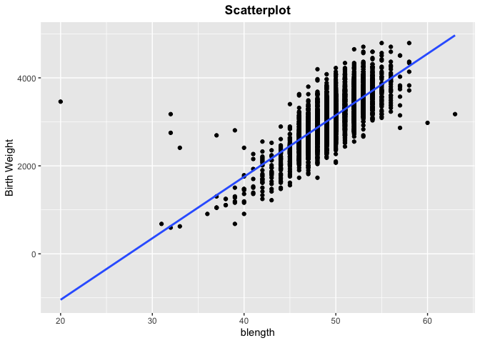<!-- -->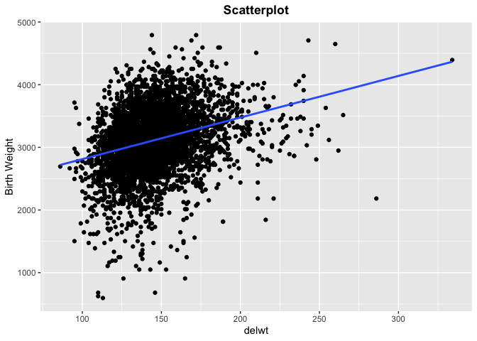<!-- -->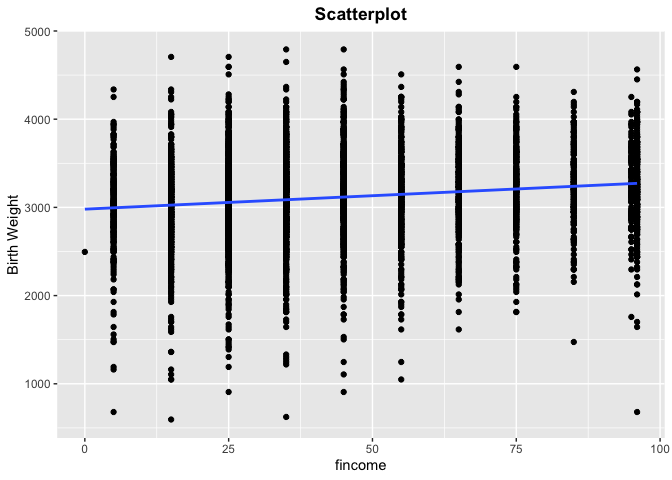<!-- -->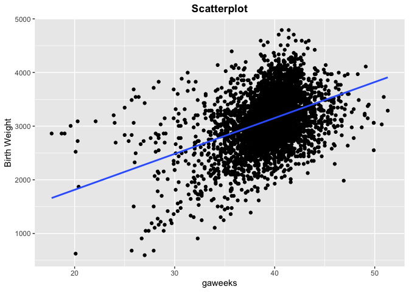<!-- -->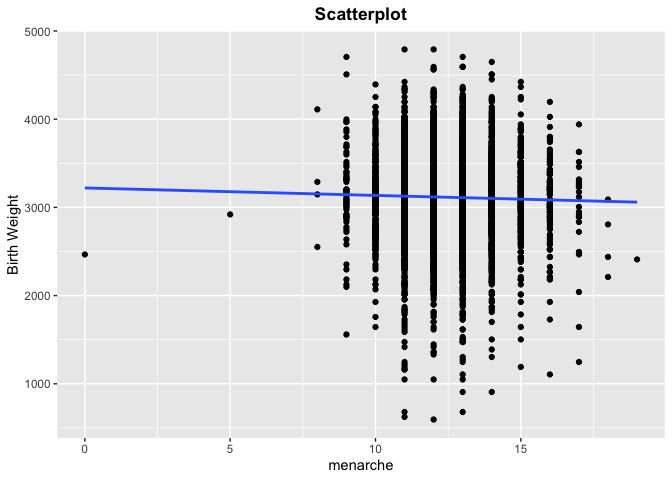<!-- -->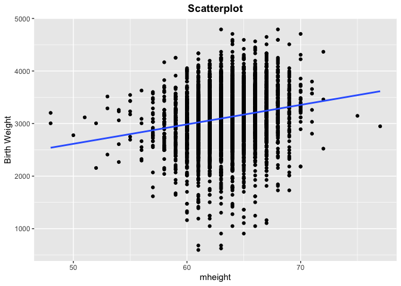<!-- -->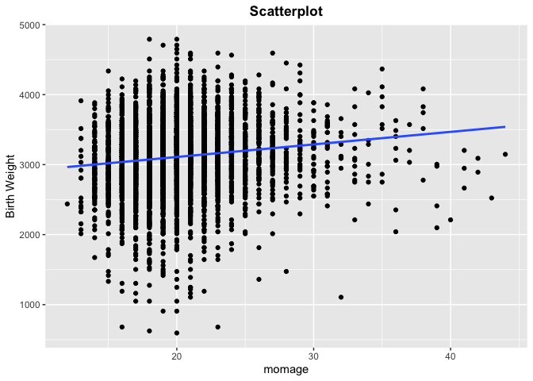<!-- -->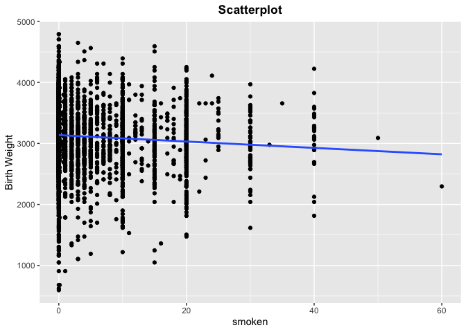<!-- -->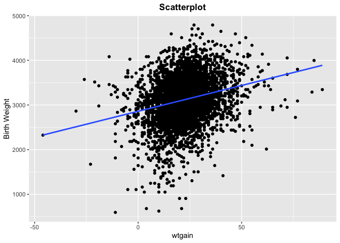<!-- -->

It seems that **bhead (baby’s head circumference at birth ) and blength
(baby’s length at birth)** show a strong linear relationship with birth
weight and **gaweeks (gestational age in weeks), delwt (mother’s weight
at delivery), and wtgain (mother’s weight at delivery)** show a moderate
linear relationship with birth weight. These scatterplots confirm the
result from the previous correlation matrix.

## Selecting final continuous independent variables based on the information obtained from the correaltion matrix and scatterplots in order to check correlation between predictors and potential interactions between them.

``` r
selected_variables <-
  cleaned_birthweight_data %>%
  select(bhead, blength, delwt, gaweeks, wtgain, bwt)

chart.Correlation(selected_variables, method = "pearson")
```

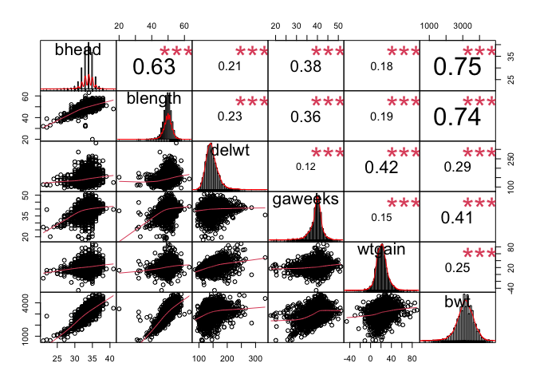<!-- -->

This plot serves the purpose of finding potential interactions between
predictors. It is to be observed that **bhead and blength** shows a
potential interaction effect or multicollinearity and **gaweeks, bhead,
and blength** shows a potential interaction effect as well as **wtgain
and delwt**.

## Final Selection of predictors including categorical variables to fit linear regression based on the previous pearson correlation matrix.

``` r
selected_variables <-
  cleaned_birthweight_data %>%
  select(bhead, blength, gaweeks, bwt, babysex, mrace)
```

## Fitting my model with interaction terms based on the information obtained in the previous parts.

``` r
fit1 <- lm(bwt ~ bhead + blength + gaweeks + babysex + mrace + bhead:blength +
             bhead:blength:gaweeks, 
           data = selected_variables)

summary(fit1) %>% 
  broom::tidy() %>%
  select(term, estimate, p.value)
```

    ## # A tibble: 10 × 3
    ##    term                    estimate  p.value
    ##    <chr>                      <dbl>    <dbl>
    ##  1 (Intercept)           -1885.     3.10e- 2
    ##  2 bhead                   -27.6    4.60e- 1
    ##  3 blength                 -33.1    1.94e- 1
    ##  4 gaweeks                  50.5    9.27e- 4
    ##  5 babysexmale             -36.9    2.13e- 5
    ##  6 mraceBlack             -120.     4.16e-39
    ##  7 mraceAsian              -90.2    3.59e- 2
    ##  8 mracePuerto Rican      -123.     1.12e-10
    ##  9 bhead:blength             4.29   5.11e- 5
    ## 10 bhead:blength:gaweeks    -0.0230 1.25e- 2

``` r
summary(fit1) %>% 
  broom::glance()
```

    ## # A tibble: 1 × 8
    ##   r.squared adj.r.squared sigma statistic p.value    df df.residual  nobs
    ##       <dbl>         <dbl> <dbl>     <dbl>   <dbl> <dbl>       <int> <dbl>
    ## 1     0.704         0.703  279.     1143.       0     9        4332  4342

The reason I chose this model as my final model is because as
aforementioned **bhead, blength, and gaweeks** are the most correlated
continuous variables with birth weight and **mrace** is also the most
correlated categorical variable with birth weight. The reason of
including **babysex** is due to hypothesized belief. Plus, all
interaction estimates in the model are statistically significant and it
has higher adjusted r-squared compared to two given models in the
question.

## Fitting the plot of my model residuals against fitted values

``` r
selected_variables %>%
  add_residuals(fit1) %>%
  add_predictions(fit1) %>%
  ggplot(aes(x = pred, y = resid)) +
  geom_point() +
  geom_smooth(method = "lm", se = FALSE) +
  labs(title = "Plot of the model residuals against fitted values",
       x = "Fitted Values", y = "Residuals") +
  theme(plot.title = element_text(hjust = 0.5, face = "bold"))
```

    ## `geom_smooth()` using formula 'y ~ x'

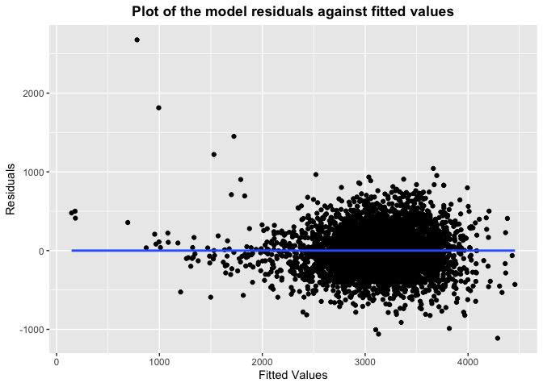<!-- -->

\#\#Computing rmse of models through cross validaiton

``` r
set.seed(77)

cv_dataset <-
  selected_variables %>% 
  crossv_mc(n = 100,test = 0.2)
  

cv_df <- 
  cv_dataset %>%
   mutate(
    train = map(train, as_tibble),
    test = map(test, as_tibble))

cv_df <-
  cv_df %>%
    mutate(
    linear_mod1  = map(train, ~lm(bwt ~ bhead + blength + gaweeks + babysex + mrace 
                                  + bhead:blength + bhead:blength:gaweeks, 
                                  data = .x)),
    linear_mod2  = map(train, ~lm(bwt ~ blength + gaweeks, data = .x)),
    linear_mod3  = map(train, ~lm(bwt ~ (bhead + blength + babysex)^3, data = .x))
    ) %>%
   mutate(
    rmse_my_model = map2_dbl(linear_mod1, test, ~rmse(model = .x, data = .y)),
    rmse_given_model1 = map2_dbl(linear_mod2, test, ~rmse(model = .x, data = .y)),
    rmse_given_model2 = map2_dbl(linear_mod3, test, ~rmse(model = .x, data = .y))
   )
```

\#\#Fitting the distribution of rmse of the models.

``` r
cv_df %>% 
  select(starts_with("rmse")) %>% 
  pivot_longer(
    everything(),
    names_to = "model", 
    values_to = "rmse",
    names_prefix = "rmse_") %>% 
  mutate(model = fct_inorder(model)) %>% 
  ggplot(aes(x = model, y = rmse)) + 
  geom_boxplot() +
  labs(title = 
  "Prediction Error Distributions across Models", 
       x = "Models", y = "Root Mean Square Error")  +
  scale_x_discrete(
    labels = c("My Model", "Test Model 1", "Test Model 2")) +
  theme(plot.title = element_text(hjust = 0.5, face = "bold"))
```

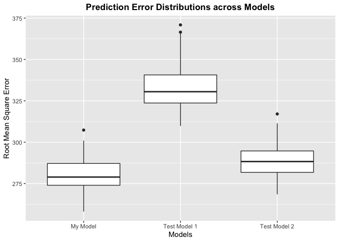<!-- -->

Here, we are comparing models with respect to the cross-validated
prediction error. By and large, my model seems to have the lowest
prediction error (rmse) and hence is potentially the best model,
followed by test model 2 (with interaction terms) and test model 1
(without interaction terms) when comparing the medians (the line in the
middle of the box) and the overall distribution of the box plots.

# Problem 2

\#\#Importing data

``` r
weather_df <- 
  rnoaa::meteo_pull_monitors(
    c("USW00094728"),
    var = c("PRCP", "TMIN", "TMAX"), 
    date_min = "2017-01-01",
    date_max = "2017-12-31") %>%
  mutate(
    name = recode(id, USW00094728 = "CentralPark_NY"),
    tmin = tmin / 10,
    tmax = tmax / 10) %>%
  select(name, id, everything())
```

    ## Registered S3 method overwritten by 'hoardr':
    ##   method           from
    ##   print.cache_info httr

    ## using cached file: ~/Library/Caches/R/noaa_ghcnd/USW00094728.dly

    ## date created (size, mb): 2021-10-05 10:12:34 (7.602)

    ## file min/max dates: 1869-01-01 / 2021-10-31

## Fitting a given model

``` r
fit0 <- lm(tmax ~ tmin, data = weather_df)
```

## Generating 5000 bootstraps of the dataset

``` r
set.seed(777)
boot_sample = function(df) {
  sample_frac(df, replace = TRUE)
}

boot_straps = 
  data_frame(
    strap_number = 1:5000,
    strap_sample = rerun(5000, boot_sample(weather_df))
  )
```

    ## Warning: `data_frame()` was deprecated in tibble 1.1.0.
    ## Please use `tibble()` instead.
    ## This warning is displayed once every 8 hours.
    ## Call `lifecycle::last_lifecycle_warnings()` to see where this warning was generated.

## Generating 5000 bootstrap estimates

``` r
bootstrap_results = 
  boot_straps %>% 
  mutate(
    models = map(strap_sample, ~lm(tmax ~ tmin, data = .x) ),
    results = map(models, broom::tidy)) %>% 
  select(-strap_sample, -models) %>% 
  unnest(results) 
```

## Computing log(Beta\_0\_hat \* Beta\_1\_hat) and getting 5000 of those estiamtes

``` r
log_betas <-  
  bootstrap_results %>%
  group_by(strap_number) %>%
  summarise(log_betas = log(estimate[1] * estimate[2])) %>%
  select(log_betas, strap_number)
```

## Generating 5000 bootstrap estimates

``` r
bootstrap_results2 <- 
  boot_straps %>% 
  mutate(
    models = map(strap_sample, ~lm(tmax ~ tmin, data = .x) ),
    results = map(models, broom::glance)) %>% 
  select(-strap_sample, -models) %>% 
  unnest(results) 
```

## Getting 5000 R-Squared estimates

``` r
r_squared <- 
  bootstrap_results2 %>%
  select(r.squared, strap_number)
```

## Fitting density plots of two estimates

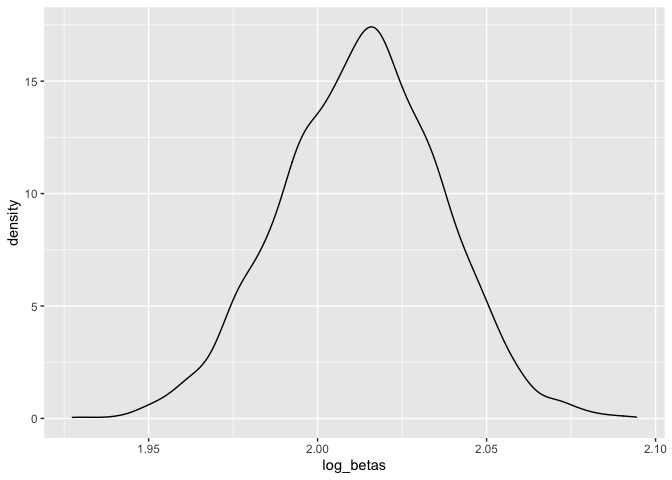<!-- -->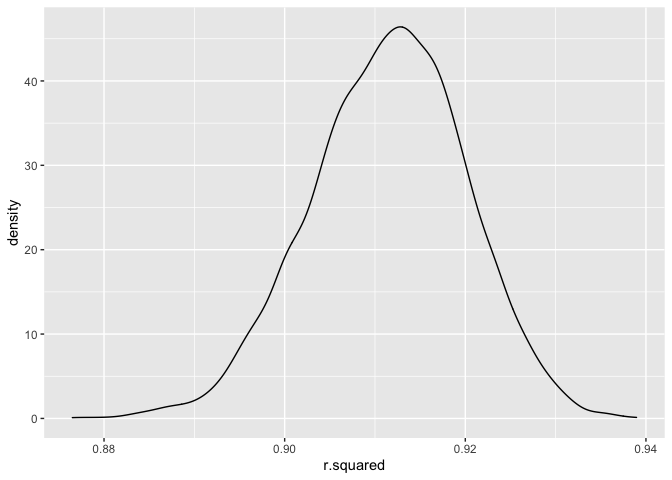<!-- -->

It is to be observed that the distribution of
*l**o**g*(*β*<sub>0</sub> \* *β*<sub>1</sub>) is approximately normally
distributed with mean of **2.012924** and standard deviation of
**0.0236157** and the distribution of *r̂*<sup>2</sup> is also
approximately normally distributed with mean of **0.9114443** and
standard deviation of **0.0085629**.

## Generating confience interval of *l**o**g*(*β*<sub>0</sub> \* *β*<sub>1</sub>)

``` r
CI_result <-
  log_betas %>%
  summarize(ci_lower = quantile(log_betas, 0.025),
            ci_upper = quantile(log_betas, 0.975)) %>%
  tibble(
    "95% CI Lower Bound of Log Betas" = as.numeric(ci_lower), 
    "95% CI Upper Bound of Log Betas" = as.numeric(ci_upper)) %>%
  select(-ci_lower, -ci_upper)

CI_result <-
  log_betas %>%
  summarize(ci_lower = quantile(log_betas, 0.025),
            ci_upper = quantile(log_betas, 0.975))

CI_result_lower <- CI_result %>% pull(ci_lower)
CI_result_upper <- CI_result %>% pull(ci_upper)
```

95% Confidence Interval of
*l**o**g*(*β*<sub>0</sub> \* *β*<sub>1</sub>): (**1.9658517**,
**2.0579253**)

## Generating confience interval of *r̂*<sup>2</sup>

``` r
CI_result2 <-
  r_squared %>%
  summarize(ci_lower = quantile(r.squared, 0.025),
            ci_upper = quantile(r.squared, 0.975)) 

CI_result_lower2 <- CI_result2 %>% pull(ci_lower)
CI_result_upper2 <- CI_result2 %>% pull(ci_upper)
```

95% Confidence Interval of *r̂*<sup>2</sup> : (**0.8942946**,
**0.9272372**)
