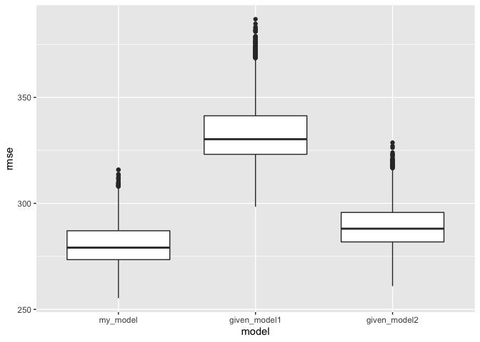

p8105\_hw6\_sl4836
================
Hun
12/2/2021

``` r
library(tidyverse)
```

    ## ── Attaching packages ─────────────────────────────────────── tidyverse 1.3.1 ──

    ## ✓ ggplot2 3.3.5     ✓ purrr   0.3.4
    ## ✓ tibble  3.1.5     ✓ dplyr   1.0.7
    ## ✓ tidyr   1.1.4     ✓ stringr 1.4.0
    ## ✓ readr   2.0.2     ✓ forcats 0.5.1

    ## ── Conflicts ────────────────────────────────────────── tidyverse_conflicts() ──
    ## x dplyr::filter() masks stats::filter()
    ## x dplyr::lag()    masks stats::lag()

``` r
library(janitor)
```

    ## 
    ## Attaching package: 'janitor'

    ## The following objects are masked from 'package:stats':
    ## 
    ##     chisq.test, fisher.test

``` r
library(rstatix)
```

    ## 
    ## Attaching package: 'rstatix'

    ## The following object is masked from 'package:janitor':
    ## 
    ##     make_clean_names

    ## The following object is masked from 'package:stats':
    ## 
    ##     filter

``` r
library(egg)
```

    ## Loading required package: gridExtra

    ## 
    ## Attaching package: 'gridExtra'

    ## The following object is masked from 'package:dplyr':
    ## 
    ##     combine

``` r
library(modelr)
library(PerformanceAnalytics)
```

    ## Loading required package: xts

    ## Loading required package: zoo

    ## 
    ## Attaching package: 'zoo'

    ## The following objects are masked from 'package:base':
    ## 
    ##     as.Date, as.Date.numeric

    ## 
    ## Attaching package: 'xts'

    ## The following objects are masked from 'package:dplyr':
    ## 
    ##     first, last

    ## 
    ## Attaching package: 'PerformanceAnalytics'

    ## The following object is masked from 'package:graphics':
    ## 
    ##     legend

# Creating a subdirectory

``` r
dir.create(file.path(getwd(), "hw6_data_file"), recursive = TRUE)
```

    ## Warning in dir.create(file.path(getwd(), "hw6_data_file"), recursive = TRUE): '/
    ## Users/iseonghun/Desktop/columbia data science/p8105_hw6_sl4836/hw6_data_file'
    ## already exists

# Importing data

``` r
birthweight_data <- read_csv("./hw6_data_file/birthweight.csv")
```

    ## Rows: 4342 Columns: 20

    ## ── Column specification ────────────────────────────────────────────────────────
    ## Delimiter: ","
    ## dbl (20): babysex, bhead, blength, bwt, delwt, fincome, frace, gaweeks, malf...

    ## 
    ## ℹ Use `spec()` to retrieve the full column specification for this data.
    ## ℹ Specify the column types or set `show_col_types = FALSE` to quiet this message.

# Tidying and wrangling the data

``` r
cleaned_birthweight_data <-
  birthweight_data %>% 
  janitor::clean_names() %>%
  mutate(across(.cols = c(babysex, frace, malform, mrace), as.factor)) %>%
  mutate(babysex = ifelse(babysex == "1", "male","female"),
         malform = ifelse(malform == "0", "absent","present"),
         frace = recode(frace, "1" = "White", "2" = "Black", "3" = "Asian", 
                        "4" = "Puerto Rican", "8" = "Other", "9" = "Unknown"),
         mrace = recode(mrace, "1" = "White", "2" = "Black", 
                        "3" = "Asian", "4" = "Puerto Rican", "8" = "Other")
         )
```

# Checking Missing Values

``` r
skimr::skim(cleaned_birthweight_data)
```

|                                                  |                            |
|:-------------------------------------------------|:---------------------------|
| Name                                             | cleaned\_birthweight\_data |
| Number of rows                                   | 4342                       |
| Number of columns                                | 20                         |
| \_\_\_\_\_\_\_\_\_\_\_\_\_\_\_\_\_\_\_\_\_\_\_   |                            |
| Column type frequency:                           |                            |
| character                                        | 2                          |
| factor                                           | 2                          |
| numeric                                          | 16                         |
| \_\_\_\_\_\_\_\_\_\_\_\_\_\_\_\_\_\_\_\_\_\_\_\_ |                            |
| Group variables                                  | None                       |

Data summary

**Variable type: character**

| skim\_variable | n\_missing | complete\_rate | min | max | empty | n\_unique | whitespace |
|:---------------|-----------:|---------------:|----:|----:|------:|----------:|-----------:|
| babysex        |          0 |              1 |   4 |   6 |     0 |         2 |          0 |
| malform        |          0 |              1 |   6 |   7 |     0 |         2 |          0 |

**Variable type: factor**

| skim\_variable | n\_missing | complete\_rate | ordered | n\_unique | top\_counts                             |
|:---------------|-----------:|---------------:|:--------|----------:|:----------------------------------------|
| frace          |          0 |              1 | FALSE   |         5 | Whi: 2123, Bla: 1911, Pue: 248, Asi: 46 |
| mrace          |          0 |              1 | FALSE   |         4 | Whi: 2147, Bla: 1909, Pue: 243, Asi: 43 |

**Variable type: numeric**

| skim\_variable | n\_missing | complete\_rate |    mean |     sd |     p0 |     p25 |     p50 |     p75 |   p100 | hist  |
|:---------------|-----------:|---------------:|--------:|-------:|-------:|--------:|--------:|--------:|-------:|:------|
| bhead          |          0 |              1 |   33.65 |   1.62 |  21.00 |   33.00 |   34.00 |   35.00 |   41.0 | ▁▁▆▇▁ |
| blength        |          0 |              1 |   49.75 |   2.72 |  20.00 |   48.00 |   50.00 |   51.00 |   63.0 | ▁▁▁▇▁ |
| bwt            |          0 |              1 | 3114.40 | 512.15 | 595.00 | 2807.00 | 3132.50 | 3459.00 | 4791.0 | ▁▁▇▇▁ |
| delwt          |          0 |              1 |  145.57 |  22.21 |  86.00 |  131.00 |  143.00 |  157.00 |  334.0 | ▅▇▁▁▁ |
| fincome        |          0 |              1 |   44.11 |  25.98 |   0.00 |   25.00 |   35.00 |   65.00 |   96.0 | ▃▇▅▂▃ |
| gaweeks        |          0 |              1 |   39.43 |   3.15 |  17.70 |   38.30 |   39.90 |   41.10 |   51.3 | ▁▁▂▇▁ |
| menarche       |          0 |              1 |   12.51 |   1.48 |   0.00 |   12.00 |   12.00 |   13.00 |   19.0 | ▁▁▂▇▁ |
| mheight        |          0 |              1 |   63.49 |   2.66 |  48.00 |   62.00 |   63.00 |   65.00 |   77.0 | ▁▁▇▂▁ |
| momage         |          0 |              1 |   20.30 |   3.88 |  12.00 |   18.00 |   20.00 |   22.00 |   44.0 | ▅▇▂▁▁ |
| parity         |          0 |              1 |    0.00 |   0.10 |   0.00 |    0.00 |    0.00 |    0.00 |    6.0 | ▇▁▁▁▁ |
| pnumlbw        |          0 |              1 |    0.00 |   0.00 |   0.00 |    0.00 |    0.00 |    0.00 |    0.0 | ▁▁▇▁▁ |
| pnumsga        |          0 |              1 |    0.00 |   0.00 |   0.00 |    0.00 |    0.00 |    0.00 |    0.0 | ▁▁▇▁▁ |
| ppbmi          |          0 |              1 |   21.57 |   3.18 |  13.07 |   19.53 |   21.03 |   22.91 |   46.1 | ▃▇▁▁▁ |
| ppwt           |          0 |              1 |  123.49 |  20.16 |  70.00 |  110.00 |  120.00 |  134.00 |  287.0 | ▅▇▁▁▁ |
| smoken         |          0 |              1 |    4.15 |   7.41 |   0.00 |    0.00 |    0.00 |    5.00 |   60.0 | ▇▁▁▁▁ |
| wtgain         |          0 |              1 |   22.08 |  10.94 | -46.00 |   15.00 |   22.00 |   28.00 |   89.0 | ▁▁▇▁▁ |

# Computing Correlation Matrix

``` r
birthweight_data %>% 
  cor_mat() %>%
  cor_gather() %>%
  filter(var1 %in% "bwt") %>%
  filter(!var2 %in% "bwt") %>%
  mutate(
    sig_p = ifelse(p < 0.01, T, F),
    cor_if_sig = ifelse(p < 0.01, cor, NA)
    ) %>% 
  ggplot(aes(
    x = var1, 
    y = var2, 
    fill = cor,
    label = round(cor_if_sig, 2))) + 
  geom_tile(color = "white") +   
  geom_text(
    color = "white",
    size = 4
  ) + 
  scale_x_discrete(
    labels = c("Birth Weight")
  ) + 
  labs(
    x = "Outcome Variable",
    y = "Predictor Variables",
    title = "Correlation Matrix between Predictors and Outcome",
    subtitle = "significant predictors at significance level 0.01",
    fill = "Correlation"
  )
```

<!-- -->

``` r
continuous_variables <-  
  cleaned_birthweight_data %>%
  select_if(is.numeric) %>%
  select(-bwt, -ppbmi, -ppwt, -pnumsga, -parity, -pnumlbw) %>%
  colnames() %>% 
  as.vector()
```

Computing pearson correlation matrix with p-values based on T-test for
correlation coefficient. Based on this correlation matrix, I selected
continuous variables to be used to fit scatterplot. The selected
variables are: *bhead, blength, delwt, fincome, gaweeks, menarche,
mheight, momage, smoken, wtgain.*

# Fitting scatterplots with selected predictors against birthweight to see if predictors have a linear trend against the outcome variable

``` r
continuous_variables <- 
  continuous_variables %>%
  as.list()

for (i in continuous_variables) {
  plot <-
  ggplot(cleaned_birthweight_data, aes_string(i,  "bwt")) + 
  geom_point() +
  geom_smooth(method = lm, se = FALSE) +
  labs(title = "Scatterplot", y = "Birth Weight") +
  theme(plot.title = element_text(hjust = 0.5))
  
  print(plot) 
}
```

    ## `geom_smooth()` using formula 'y ~ x'

<!-- -->

    ## `geom_smooth()` using formula 'y ~ x'

<!-- -->

    ## `geom_smooth()` using formula 'y ~ x'

<!-- -->

    ## `geom_smooth()` using formula 'y ~ x'

<!-- -->

    ## `geom_smooth()` using formula 'y ~ x'

<!-- -->

    ## `geom_smooth()` using formula 'y ~ x'

<!-- -->

    ## `geom_smooth()` using formula 'y ~ x'

<!-- -->

    ## `geom_smooth()` using formula 'y ~ x'

<!-- -->

    ## `geom_smooth()` using formula 'y ~ x'

<!-- -->

    ## `geom_smooth()` using formula 'y ~ x'

<!-- -->

# Selecting final numerical independent variables based on the information obtained from the correaltion matrix and scatterplots in order to check correlation between predictors and potential interactions between them.

``` r
numerical_variables <-
  cleaned_birthweight_data %>%
  select(bhead, blength, delwt, gaweeks, wtgain, bwt)

chart.Correlation(numerical_variables, method = "pearson")
```

<!-- -->

# Final Selection of predictors to fit linear regression.

``` r
selected_variables <-
  cleaned_birthweight_data %>%
  select(bhead, blength, delwt, gaweeks, wtgain, bwt, 
         babysex, mrace)
```

# Fitting my model with two interaction terms and checking if my model meets the assumptions for linear regression

``` r
fit1 <- lm(bwt ~ bhead + blength + gaweeks + babysex + mrace + bhead:blength +
             bhead:blength:gaweeks, 
           data = selected_variables)
```

``` r
selected_variables %>%
  add_residuals(fit1) %>%
  add_predictions(fit1) %>%
  ggplot(aes(x = pred, resid)) +
  geom_point() +
  geom_smooth(method = "lm", se = FALSE)
```

    ## `geom_smooth()` using formula 'y ~ x'

<!-- -->

``` r
set.seed(77)

cv_dataset <-
  selected_variables %>% 
  crossv_mc(n = 4342,test = 0.2)
```

``` r
cv_df <- 
  cv_dataset %>%
   mutate(
    train = map(train, as_tibble),
    test = map(test, as_tibble))
```

``` r
cv_df <-
  cv_df %>%
    mutate(
    linear_mod1  = map(train, ~lm(bwt ~ bhead + blength + gaweeks + babysex + mrace 
                                  + bhead:blength + bhead:blength:gaweeks, 
                                  data = .x)),
    linear_mod2  = map(train, ~lm(bwt ~ blength + gaweeks, data = .x)),
    linear_mod3  = map(train, ~lm(bwt ~ (bhead + blength + babysex)^3, data = .x))
    ) %>%
   mutate(
    rmse_my_model = map2_dbl(linear_mod1, test, ~rmse(model = .x, data = .y)),
    rmse_given_model1 = map2_dbl(linear_mod2, test, ~rmse(model = .x, data = .y)),
    rmse_given_model2 = map2_dbl(linear_mod3, test, ~rmse(model = .x, data = .y))
   )
```

``` r
cv_df %>% 
  select(starts_with("rmse")) %>% 
  pivot_longer(
    everything(),
    names_to = "model", 
    values_to = "rmse",
    names_prefix = "rmse_") %>% 
  mutate(model = fct_inorder(model)) %>% 
  ggplot(aes(x = model, y = rmse)) + 
  geom_boxplot() 
```

<!-- -->
